~~Initially didnt find any subdomains~~, however it was due to using _subfinder_, so pulled up my g named ffuf and got the real deal.
>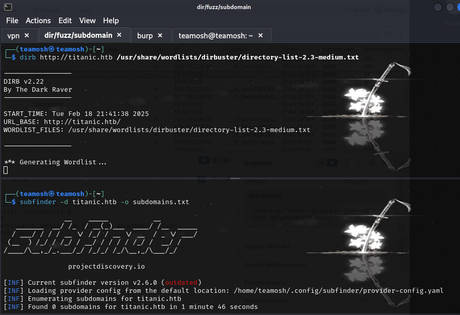

It immediately found dev subdomain, which contains gitea, which contains 1) docker-config and 2) flask app file
>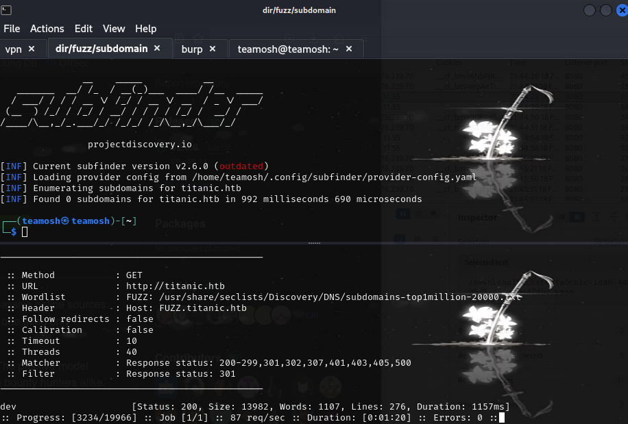
>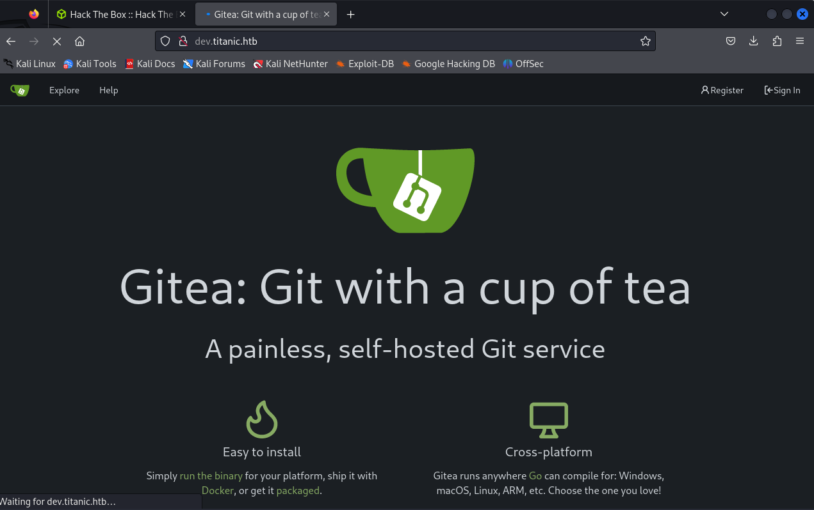
>>Bazar zhok, nashel creds.
>>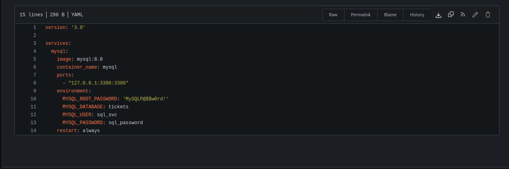
>> I have a conf file
>>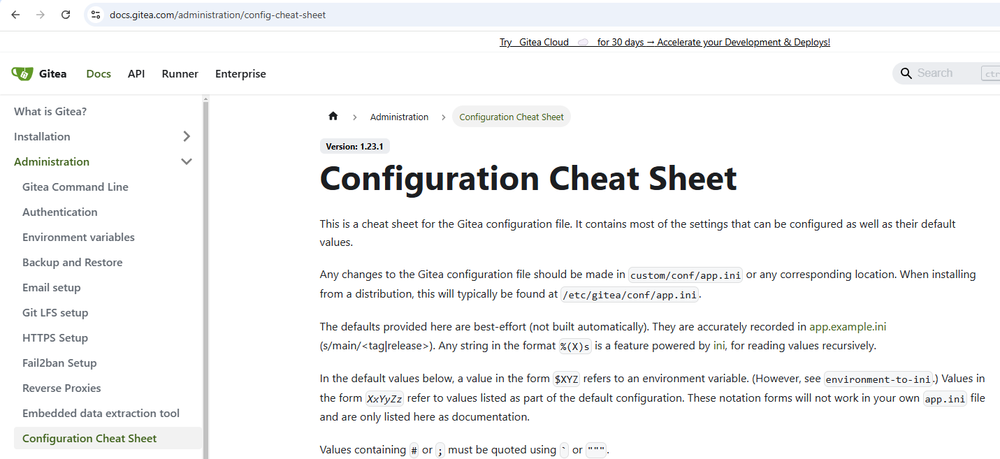
>> I have a path
>>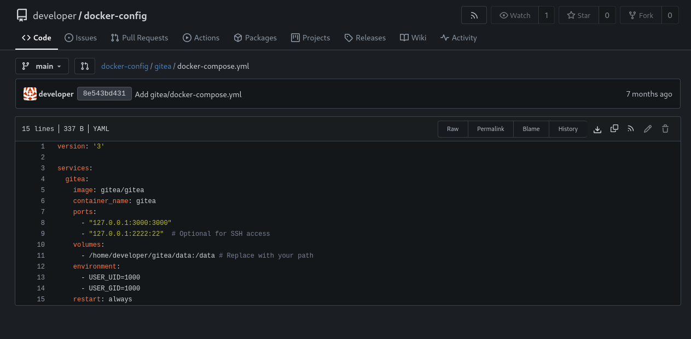
>> ugh, path of a conf file.
---
### Found LFI in post request
doesnt need explanation

>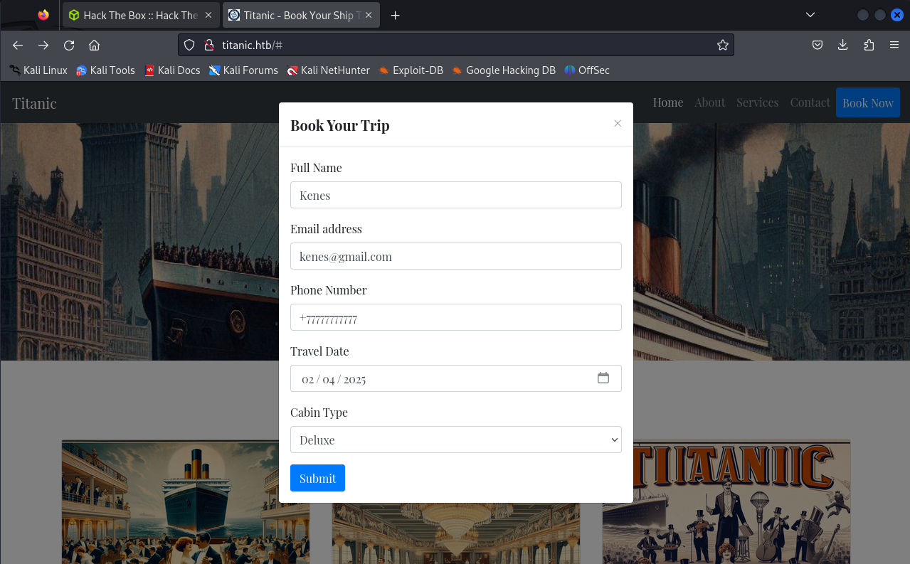
>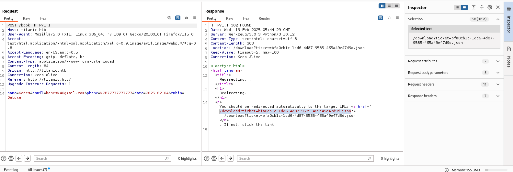
>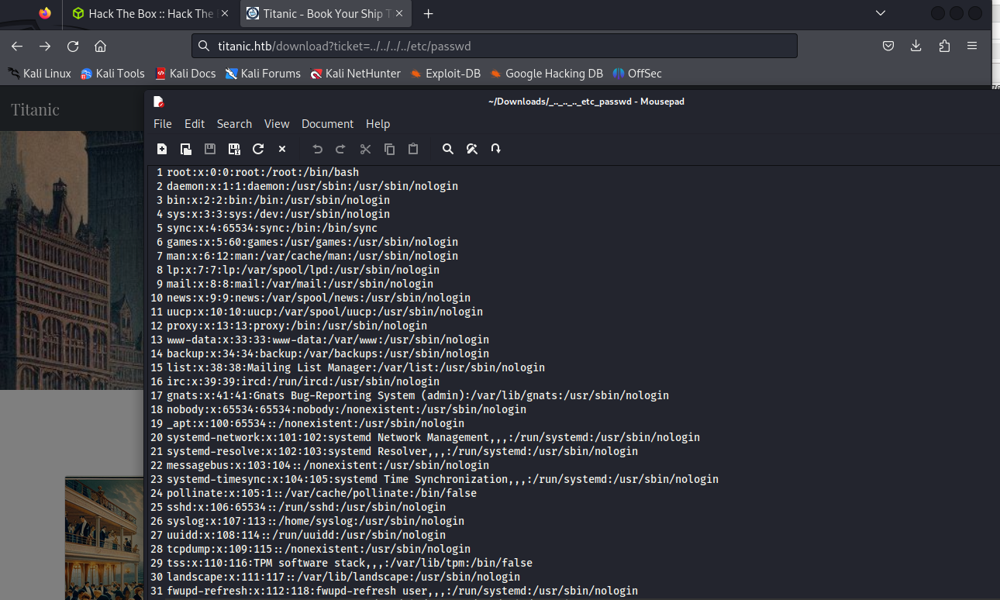
---
> Now use LFI to read conf file:
>>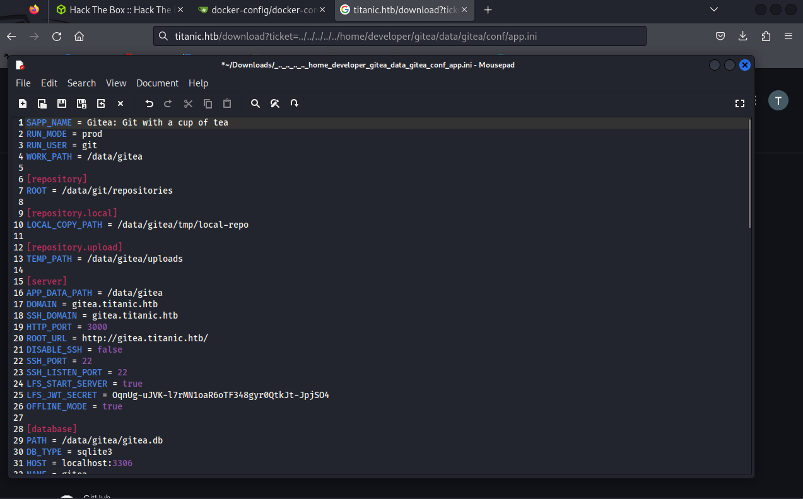
>>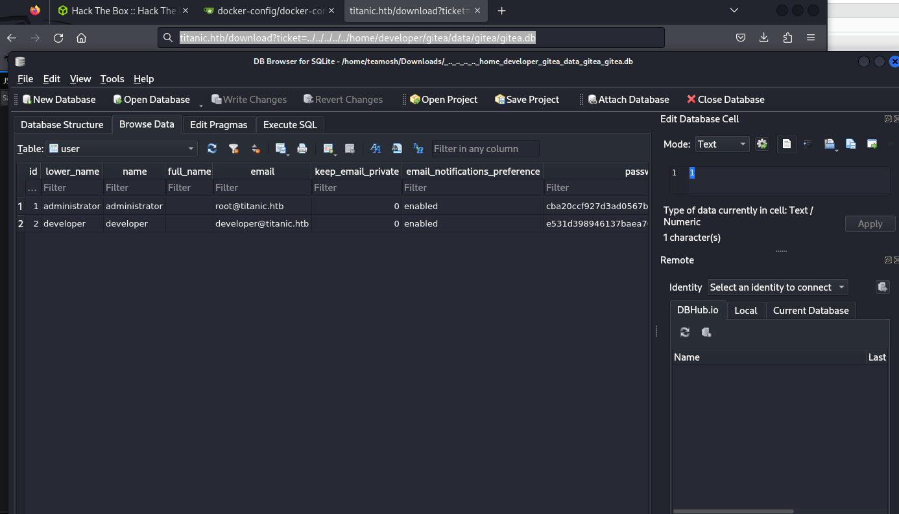
>>crack developer hash, which is pbkdf2$50000$50.
>>
>>It can be done, pretty easily using useful 0xdf command that retrives from db and saves it in correct format. It can be found in my cheatsheet, or his website
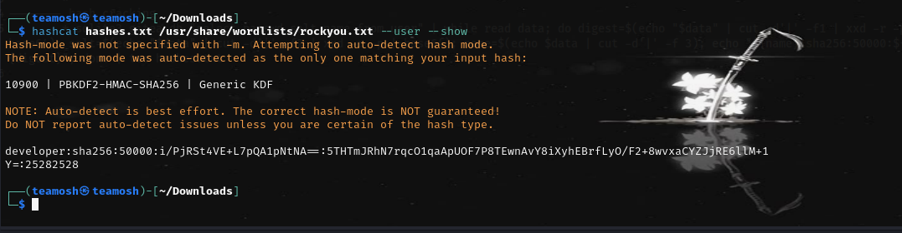

Now connect through ssh and get the user.txt

To be continued: root flag